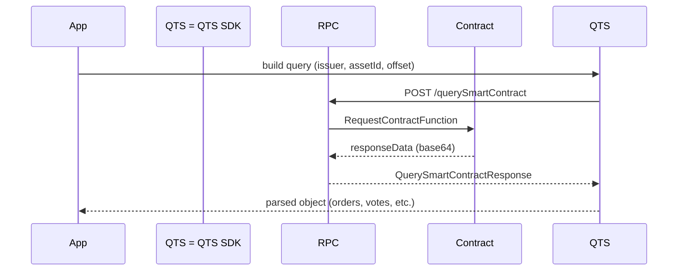

import { Callout } from 'fumadocs-ui/components/callout';
import { Steps } from 'fumadocs-ui/components/steps';

# Smart Contract Lifecycle

Qubic contracts are not EVM bytecode: they are C++ headers compiled with the **QPI** (Qubic Programming Interface) and
executed by deterministically scheduled *computors*. Understanding this lifecycle helps you design SDK calls that are
robust and future-proof.

## 1. Layout inside the contract

Every contract header contains three building blocks:

<Steps>
  

    <strong>State</strong>
    

      Declares storage as plain structs/collections — no dynamic allocation, no pointers. The state is initialised once
      and replicated across computors.
    

  

  

    <strong>Functions</strong>
    

      Read-only entry points exposed via <code>REGISTER_USER_FUNCTION</code>. They can only call functions from contracts
      with a lower index and are run through the <code>RequestContractFunction</code> message type.
    

  

  

    <strong>Procedures</strong>
    

      Mutating entry points registered with <code>REGISTER_USER_PROCEDURE</code>. They are executed when a transaction is
      mined and can transfer value, burn fees, and update state.
    

  

</Steps>

<Callout type="info" title="No dynamic allocations">
  Contracts cannot allocate memory on the fly. Any buffer you expect to use — order books, vote counts, poll metadata —
  has to be declared upfront. This is why response payloads are often fixed-size arrays filled with blank entries.
</Callout>

## 2. Invocation flow

1. **Client serializes** the request using `SmartContractQuery`. Each primitive is written in little-endian form and the
   final buffer is converted to base64.
2. **RPC relays** the query to the network. For functions, the result is returned immediately once a quorum answers. For
   procedures, you only receive `txId`/`status`, while the actual effects land when the tick is processed.
3. **Response parsing** relies on the exact same schema defined in the header (`readInt32`, `readIdentity`, etc.). The SDK
   helpers in `contracts-easy.ts` encapsulate the current schema for the major contracts.

## 3. Working with the SDK

- **Identity encoding**: `addIdentity` now converts the 60-character checksum identity into the 32-byte representation used
  by contracts. Always validate human input via `identityToBytes` before sending requests.
- **Versioning**: Keep helpers inside `contracts-easy.ts`. When a contract upgrades (new fields, different array sizes),
  you only have to adjust the helper. Call-site code remains stable.
- **Streaming data**: If you need to process every order in a 256-entry array, treat `readIdentity()` returning an empty
  string as “end of data” — contracts zero-fill the remaining slots.

## 4. Troubleshooting checklist

- **Mismatch length errors** → verify that `inputSize` matches the number of bytes you appended. `SmartContractQuery`
  does this for you as long as you only use the chainable `add*` helpers.
- **Weird characters in identity** → you likely attempted to read a 60-byte string from a contract that now returns a 32-byte
  identity. Use `readIdentity()` instead of `readString(60)` so you automatically pick up the newer encoding.
- **Procedures failing silently** → inspect the corresponding function logs. For example, CCF exposes the last transfers
  via `getLatestTransfers`; decode the raw payload with `parseResponse` to see failure reasons.

## 5. Architecture recap

- Contracts are compiled once, distributed to all computors, and referenced by integer indices (`QUBIC_CONTRACTS`).
- Functions are pure reads enforced by the runtime — they cannot mutate state even if you try.
- Procedures are driven by transactions and must self-impose guards (invocation reward, fee checks, invariants).
- Responses are deterministic snapshots of the internal structs, so clients can deterministically re-parse them years later.

With these constraints in mind you can treat each helper in the SDK as a *typed RPC layer* over a deterministic C++ world.
Whenever you need extra fields, inspect the upstream header (the repo linked in the main README) and extend the helper
accordingly.
